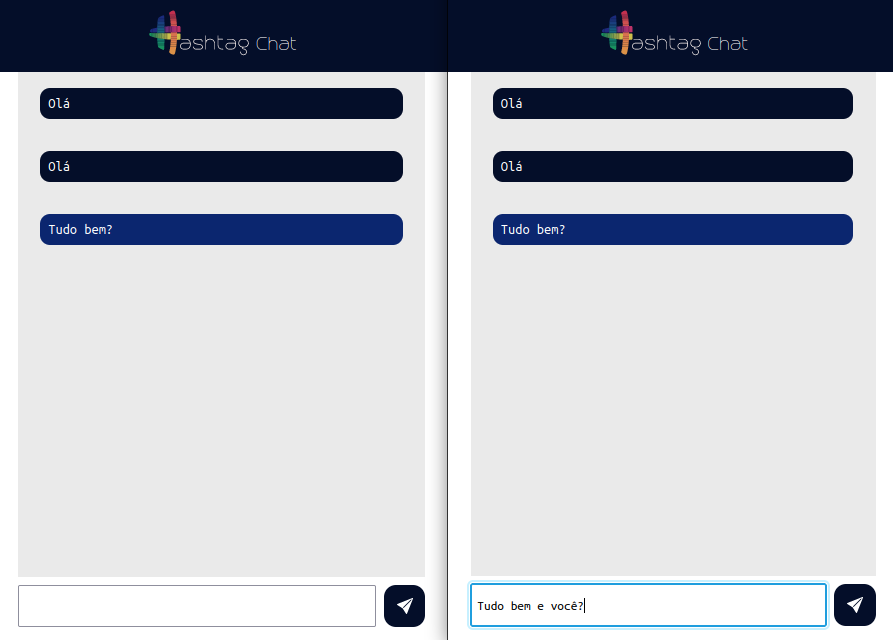

# Hashtag Chat

Um chat em tempo real desenvolvido durante o Intensivão de JavaScript da HashTag Treinamentos 

## Como usar
- Faça o clone do repositório
- Acesse a pasta do projeto
- No terminal, digite `node --watch server.js`
- Em um navegador acesse: `localhost:3000`
- Pronto, agora o seu chat esta funcionando! 🎉🎉🎉

## Tecnologias usadas

- HTML
- CSS
- JavaScript
- NodeJS
- Express
- Socket.io